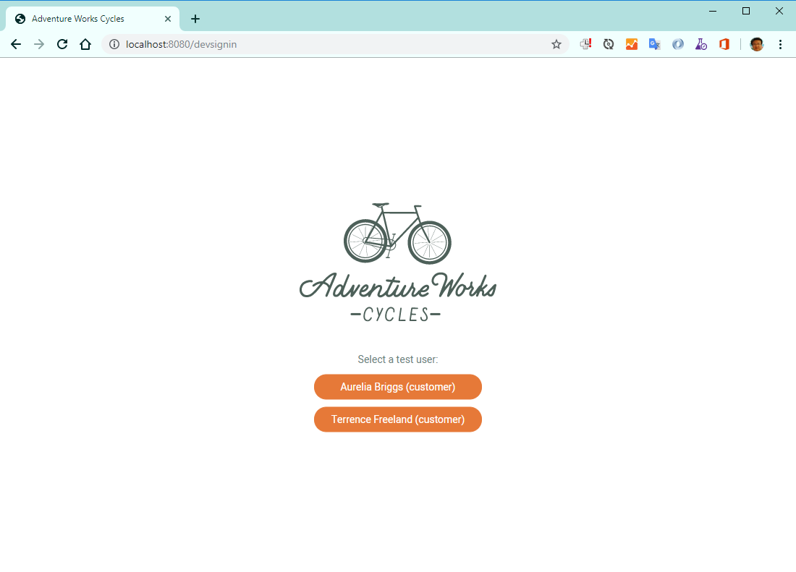

# Bike Sharing Sample: Iteratively Develop and Debug Microservices in Kubernetes

[](https://dev.azure.com/demo-devops101/BikeSharingApp/_build/latest?definitionId=63&branchName=master)

## Quickstart

[Quickstart: Team development on Kubernetes using Azure Dev Spaces](https://docs.microsoft.com/en-us/azure/dev-spaces/quickstart-team-development).

## Architecture 

BikeSharingApp consists with 5 backend services, 1 service gateway and 1 web frontend. The [users] service is using a sqlserver-linux database as it's database, and the rest services [billing] [reservation] and [reservationengine] are all storing data in a MongoDB database. 

There is also a [PopulateDatabase] job will be running when the whole system starts up and populate data into the databases, this job will finish and exit when the population job is done. This job is not showing on the following diagram.


## Demo 1 - Run application locally

Run the following scripts to build and run the whole system on your local machine. You need to assign at least 2 cpu cores and 4G Ram for your docker environment. 

```shell
docker-compose -p bikesharingapp build
docker-compose up
```
Then open http://localhost:8080




## Demo 2 - Use Azure Kubernetes Services and Dev Space to debug application

1. Prep AKS

```shell

## Create the resource group
az group create --name MyResourceGroup --location southeastasia

## Create AKS Cluster
## BikeSharingApp need at least 3 nodes to run
az aks create -g MyResourceGroup -n MyAKS --location southeastasia --node-vm-size Standard_DS2_v2 --node-count 3 --disable-rbac --generate-ssh-keys

## Enbable Dev Space
az aks use-dev-spaces -g MyResourceGroup -n MyAKS --space dev --yes
## check 'Show hidden types' in MyResourceGroup and add current azure user into Owner role of the Microsoft.DevSpaces/controllers AIM list

## Get kubeconfig to local machine in order to use kubectl
az aks get-credentials -g MyResourceGroup -n MyAKS
kubectl get nodes

```

Add current azure user account into DevSpaceControllers' owner group


2. Helm Install

```shell
cd /BikeSharingApp/

$ azds show-context

Name                ResourceGroup     DevSpace  HostSuffix
------------------  ----------------  --------  -----------------------
MyAKS               MyResourceGroup   dev       fedcab0987.eus.azds.io
```

Replace <REPLACE_ME_WITH_HOST_SUFFIX> with HostSuffix

```shell
cd charts/
helm init --wait
helm install -n bikesharing . --dep-up --namespace dev --atomic --wait
```
Wait for the install finishes

```
$ azds list-uris
Uri                                                 Status
--------------------------------------------------  ---------
http://dev.bikesharingweb.fedcab0987.eus.azds.io/  Available
http://dev.gateway.fedcab0987.eus.azds.io/         Available
```

3. Create more dev spaces

```shell
azds space select -n dev/azureuser1 -y
azds space select -n dev/azureuser2 -y
```

4. Debug the application using Dev Space

Switch to `dev/azureuser2` then use another vscode window to open /BikeSharingWeb/ folder

make sure you have Azure Dev Space extension installed

Press F1 and select "Prepare configuration files for Dev Spaces"

in vscode, press debug button.

5. Delete the cluster

```shell

## Delete AKS Cluster
az aks delete -g MyResourceGroup -n MyAKS
```

Happy Coding!